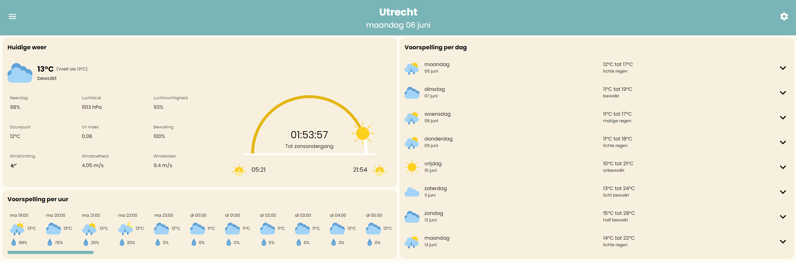
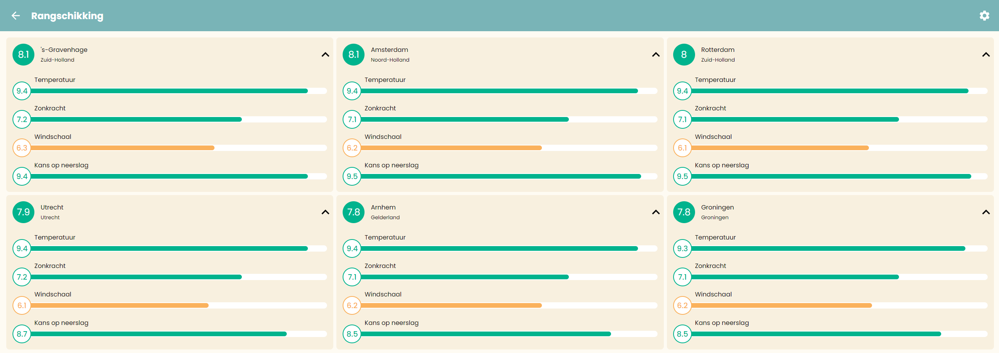

# Weerkompas

Door: Timo Noordzee 
Projectpagina: https://github.com/Timo-Noordzee/novi-weather-app

De Weerkompas applicatie is een weer app met een twist. In deze applicatie heb je zelf invloed op hoe weercijfers
berekend worden. In de instelling van de app kun je je weervoorkeur instellen. Deze voorkeur wordt gebruikt bij het
berekenen van weercijfers.

## Installeren

Om de weerkompas applicatie te gebruiken hoeft je niets te installeren. De applicatie is beschikbaar
op [novi-weather.web.app](https://novi-weather.web.app/).

Indien gewenst is het ook mogelijk de applicatie lokaal te draaien door onderstaande stappen te doorlopen.

1. Clone het project ``git clone https://github.com/Timo-Noordzee/novi-weather-app.git``
2. Open het project in een IDEA naar keuze (zoals Webstorm)
3. Installeer de npm dependencies met het ``npm install`` commando
4. Start de applicatie met het ``npm run start`` commando

Na het doorlopen van deze 4 stappen is de applicatie lokaal beschikbaar op http://localhost:3000/

Om zelf een productie build van de applicatie te maken kun je het commando ``npm run build`` gebruiken. De build wordt
gemaakt in de `build` map.

## Inloggegevens

Het is eenvoudig om een account aan te maken voor de Weerkompas. Alles wat je hiervoor nodig hebt is een e-mailadres en
wachtwoord. Er is ook een demoaccount beschikbaar dat gebruikt kan worden bij het testen van de applicatie. Onderstaande
credentials kunnen gebruikt worden om in te loggen op dit demoaccount.

| Emailadres | demo@novi.nl |
|------------|--------------|
| Wachtwoord | Frontend2022 |

## Relevante documenten

Voor de applicatie zijn 3 relevante documenten beschikbaar die meer inzicht geven in hoe de applicatie tot stand is
gekomen en de gemaakte keuzes.

### Functioneel ontwerp

Het [functioneel ontwerp](files/Functioneel%20ontwerp.pdf) geeft inzicht in de totstandkoming van de applicatie van
probleemstelling naar wireframes tot
een volledig uitwerkt ontwerp in Adobe XD.

### Ontwerp in Adobe XD

Het ontwerp gemaakt in Adobe XD is te vinden
in [files/Novi Fontend - Weather App.xd](files/Novi%20Frontend%20-%20Weather%20App.xd)

### Verantwoordingsdocument

Het [verantwoordingsdocument](files/Verantwoordingsdocument.pdf) bevat onderbouwingen van gemaakte technische keuzes.
Daarnaast bevat dit document een beschrijving van de limitaties van de applicatie en mogelijke doorontwikkelingen.
